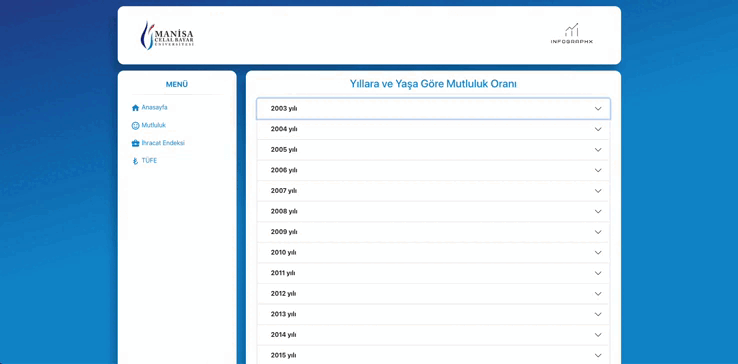

# Software Engineering Project

This project includes a comprehensive database and web-based platform specially prepared for the collection and reporting of statistics in the Turkish Statistical Institute (TUIK) system.

## Features

- Collecting and reporting statistics in the TURKSTAT system.
- The opportunity for users to query data related to their activities.
- Transferring Excel files downloaded from TURKSTAT system to the database of the application.
- Dynamic rotation of data according to user demands.

## Used technologies

**Backend:**
   - .NET Core Web API
   - MSSQL
   - Entity Framework
   - NPOI (Excel conversion)
   - xUnit (Unit Test)

  **Frontend:**
- React
- [Material-UI](https://mui.com/) - A library for modern and customizable React components.
- [Chart.js](https://www.chartjs.org/) and [React Chartjs-2](https://www.npmjs.com/package/react-chartjs-2) - For chart and data visualization libraries used.
- [ApexCharts](https://apexcharts.com/) and [React ApexCharts](https://apexcharts.com/react-chart-demos/) - Libraries used to create interactive charts.
- [D3.js](https://d3js.org/) - A library used for data visualization and manipulation.

## How Does It Work
1. Download the project files to your computer.
2. For the backend, start the API using the `dotnet run` command.
3. For frontend, start the React application using `npm install` and `npm start` commands.

***PLACES THAT NEED CHANGE***

1- API

- When you open the project, you will first need to migrate. The database (MsSQL) must be created with these two commands in the Nuget package manager (add-migration mig_1) and then (update-database).
- Set the extensions of the downloaded files according to your needs in the ExcelImportController class.
- Update the client ports in WithOrigins in Program.cs with your own port number.

2- CLIENT

- Whatever local host the API runs on, set the endpoints according to the API in the menu.js section in the frontend.

## Contributors
NUH AYDOĞDU,
UMUTCAN TURK,
CANBERK AKAR,
ERAY AĞARER,
SUMER CAN ERTUĞRAL,
ALI MERT YILMAZ,
EYYUP COKER

## Gains
- Improving data collection and reporting processes by creating a database and web-based platform integrated with the TURKSTAT system.
- Gaining command of technologies such as .NET Core, MSSQL, Entity Framework.
- Developing a modern frontend application using React.
- Abilities to import and convert Excel files to database with NPOI library.
- Developing Unit Test writing and application testing skills.
